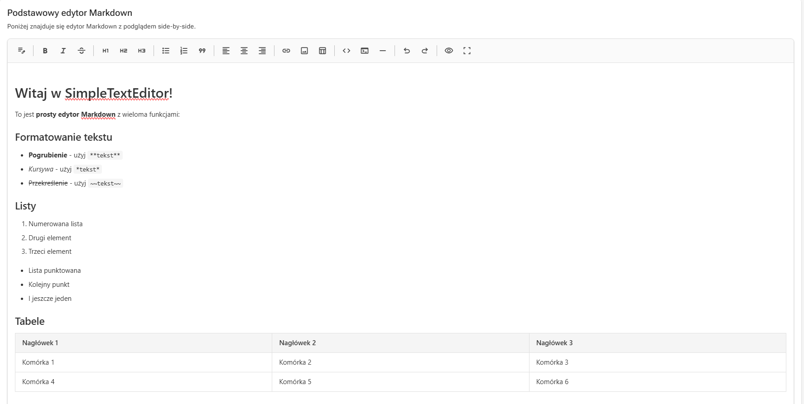
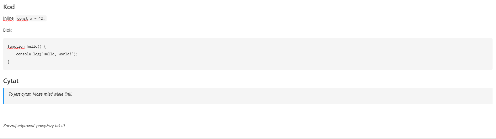
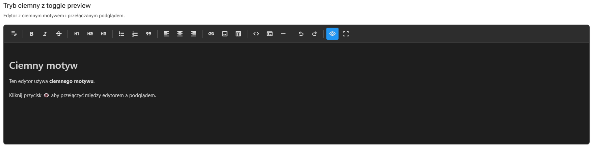

# SimpleTextEditor

Generyczny, konfigurowalny edytor Markdown dla aplikacji Blazor. Dystrybuowany jako pakiet NuGet ze wsparciem dla komponentów UI Radzen.

📖 **[Pełna dokumentacja](DOCUMENTATION_PL.md)** — szczegółowy opis interfejsów, przykłady implementacji handlerów obrazów, lokalizacji, motywów i więcej.

## Funkcje

- 📝 Pełne wsparcie Markdown (nagłówki, pogrubienie, kursywa, listy, tabele, obrazy, bloki kodu)
- 🎨 Konfigurowalne motywy (jasny/ciemny)
- 🌍 Wbudowana lokalizacja (EN, PL)
- 🔧 Rozszerzalni dostawcy ikon (Google Material Icons domyślnie)
- 👁️ Podgląd na żywo (obok siebie lub tryb przełączania)
- ⚡ Łatwa integracja z dowolną bazą danych (zwraca czyste ciągi Markdown/HTML)

## Zrzuty ekranu

### Jasny motyw — WYSIWYG


### Renderowanie kodu i cytatów


### Ciemny motyw


## Instalacja

```bash
dotnet add package SimpleTextEditor.Radzen
```

## Szybki start

### 1. Zarejestruj usługi w `Program.cs`

```csharp
using SimpleTextEditor.Radzen.Extensions;

builder.Services.AddRadzenMarkdownEditor();
```

### 2. Dodaj do `_Imports.razor`

```razor
@using SimpleTextEditor.Radzen.Components
```

### 3. Użyj komponentu

```razor
<RadzenMarkdownEditor 
    @bind-Value="@_content"
    PreviewMode="PreviewMode.SideBySide" />

@code {
    private string _content = "";
}
```

## Konfiguracja

### Niestandardowe ikony

```csharp
public class MyIconProvider : IIconProvider
{
    public string GetIcon(string name) => name switch
    {
        "bold" => "bi-type-bold",
        "italic" => "bi-type-italic",
        _ => $"bi-{name}"
    };
}

builder.Services.AddRadzenMarkdownEditor(options =>
{
    options.IconProvider = new MyIconProvider();
});
```

### Zmienne CSS

Nadpisz te niestandardowe właściwości CSS w arkuszu stylów swojej aplikacji:

```css
:root {
    --ste-toolbar-bg: #1a1a2e;
    --ste-toolbar-button-color: #ffffff;
    --ste-editor-font-family: 'Fira Code', monospace;
    --ste-editor-font-size: 14px;
    --ste-preview-bg: #f5f5f5;
}
```

### Niestandardowy pasek narzędzi

```csharp
builder.Services.AddRadzenMarkdownEditor(options =>
{
    options.ToolbarItems = new[]
    {
        ToolbarItems.Bold,
        ToolbarItems.Italic,
        ToolbarItems.Separator,
        ToolbarItems.Heading1,
        ToolbarItems.BulletList
    };
});
```

### Lokalizacja

```csharp
builder.Services.AddRadzenMarkdownEditor(options =>
{
    options.Language = "pl";
    // Lub podaj niestandardowe tłumaczenia:
    options.CustomTranslations = new Dictionary<string, string>
    {
        ["bold"] = "Pogrubienie",
        ["italic"] = "Kursywa"
    };
});
```

## Licencja

Licencja MIT — zobacz plik [LICENSE](LICENSE).

Autor: Maurycy Bartczak
